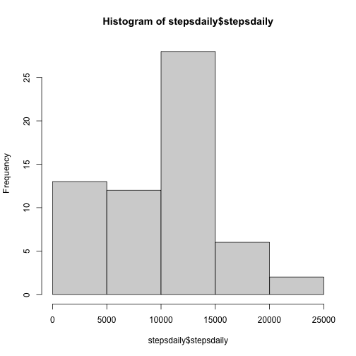
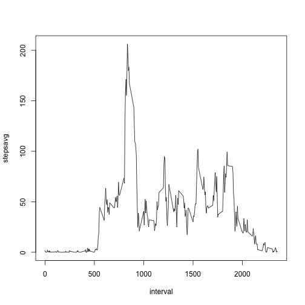
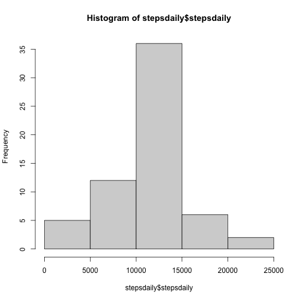
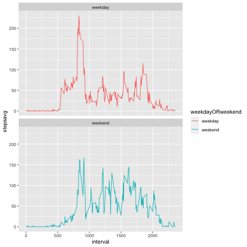
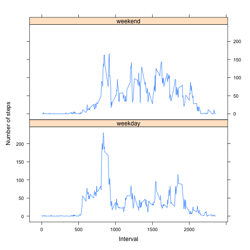

---
title: "Reproducible Research: Peer Assessment 1"
output: 
  html_document:
    keep_md: true
--- 
### Loading and preprocessing the data


```r
file<-"activity.csv"
data<-read.csv(file, header = T, sep = ",")
```
    
      
### What is mean total number of steps taken per day?


```r
data$date<-as.Date(data$date)
stepsdate<-dplyr::group_by(data, date)
stepsdaily<-dplyr::summarize(stepsdate, stepsdaily = sum(steps, na.rm=TRUE))
hist(stepsdaily$stepsdaily)
```



```r
summary(stepsdaily$stepsdaily)
```

```
##    Min. 1st Qu.  Median    Mean 3rd Qu.    Max. 
##       0    6778   10395    9354   12811   21194
```
##### Mean of the total number of steps taken per day equals 9354
##### Median of the total number of steps taken per day equals 10395    

### What is the average daily activity pattern?


```r
stepsinterval<-dplyr::group_by(data, interval)
stepsavg<-dplyr::summarize(stepsinterval, stepsavg = mean(steps, na.rm=TRUE))
with(stepsavg, plot(interval, stepsavg, type="l"))
```



```r
stepsavg$stepsavg<-round(stepsavg$stepsavg,2)
stepsavg[stepsavg$stepsavg==max(stepsavg$stepsavg),]
```

```
## # A tibble: 1 × 2
##   interval stepsavg
##      <int>    <dbl>
## 1      835     206.
```
##### Averaged across all the days days 5-minute interval number 835 (8:35 am) 
##### contains the maximum number of steps   

### Imputing missing data


```r
colSums(is.na(data))
```

```
##    steps     date interval 
##     2304        0        0
```
##### Total missing values in the dataset equal 2304  
##### Thera are 8 whole days with no step data. Thus I suggest to impute the missing values based on averaged intervals across the set.


```r
stepsavg$stepsavg<-as.integer(round(stepsavg$stepsavg))
data[is.na(data$steps), 1] <- rep(stepsavg$stepsavg, 2304/288)
head(data)
```

```
##   steps       date interval
## 1     2 2012-10-01        0
## 2     0 2012-10-01        5
## 3     0 2012-10-01       10
## 4     0 2012-10-01       15
## 5     0 2012-10-01       20
## 6     2 2012-10-01       25
```

```r
stepsdate<-dplyr::group_by(data, date)
stepsdaily<-dplyr::summarize(stepsdate, stepsdaily = sum(steps))
hist(stepsdaily$stepsdaily)
```



```r
summary(stepsdaily$stepsdaily)
```

```
##    Min. 1st Qu.  Median    Mean 3rd Qu.    Max. 
##      41    9819   10762   10766   12811   21194
```

##### Mean of the total number of steps taken per day equals 10766
##### Median of the total number of steps taken per day equals 10762
###### Inference: data imputing significantly decreased number of days with 0-5000 step count and noticeably augmented number of days  
###### with 10000-15000 step count. There is a 3041 step augmentation in 1st quartile, mean and median values increased by   
###### 1412 and 367 steps respectively.  

### Are there differences in activity patterns between weekdays and weekends?


```r
# Preparing data
data$weekday<-weekdays(data$date)
weekday<-unique(data$weekday)[1:5]
weekend<-unique(data$weekday)[6:7]

data$weekdayORweekend[data$weekday %in% weekday]<-"weekday"
data$weekdayORweekend[data$weekday %in% weekend]<-"weekend"
data$weekdayORweekend<-factor(data$weekdayORweekend)

stepsinterval<-dplyr::group_by(data, interval, weekdayORweekend)
stepsavg<-dplyr::summarize(stepsinterval, stepsavg = mean(steps))
```


```r
# Plotting
library(ggplot2)
ggplot(stepsavg, aes(interval, stepsavg, colour=weekdayORweekend)) +
geom_line() + facet_wrap(~ weekdayORweekend,nrow=2)
```



```r
# Optional
library(lattice)
xyplot(stepsavg~interval|factor(weekdayORweekend),
       data=stepsavg,
       type = "l",
       xlab = "Interval",
       ylab = "Number of steps",
       layout=c(1,2))
```




